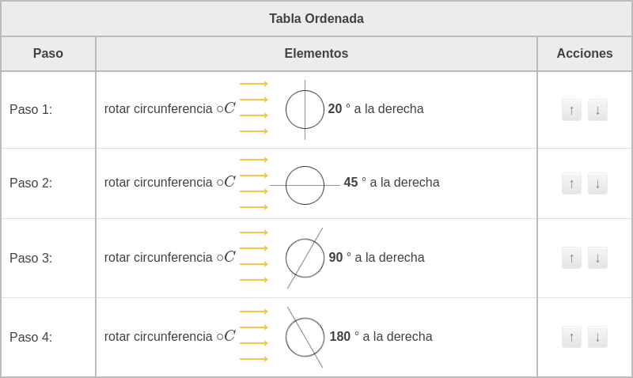

# CMM Order XBlock

CMM Order Table XBlock es una herramienta educativa diseñada para integrarse en [cursos de edX](https://www.edx.org/). Esta herramienta permite a los estudiantes ordenar elementos en una secuencia específica, lo cual es útil para evaluar su comprensión de procesos, pasos o conceptos que deben seguir un orden particular.

Actualmente este Xblock solo está disponible en español.

## Instalación

El método de instalación de CMM Order XBlock puede variar según tu configuración de Open edX. Se recomienda consultar la [documentación oficial](https://edx.readthedocs.io/projects/edx-installing-configuring-and-running/en/latest/configuration/install_xblock.html) para obtener orientación detallada.

Para activar CMM Order XBlock en un curso, debe agregarse a la lista de módulos avanzados. Esto se puede hacer en la configuración avanzada del curso ingresando `cmmorder` como nombre del módulo.

## Cómo usar

- Crear una lista en el estudio
- Definir los órdenes correctos
- Crear la lista desordenada que verán los estudiantes

### Configuración del contenido

El CMM Order XBlock permite configurar:

- **Título**: Especifica el título del módulo
- **Descripción**: Proporciona instrucciones o contexto para la actividad
- **Elementos a ordenar**: Lista de elementos que los estudiantes deben ordenar
- **Orden correcto**: Define el orden correcto de los elementos
- **Retroalimentación**: muestra la tabla ordenada

## Casos de uso

- Ordenar los pasos de un proceso científico
- Secuenciar eventos históricos en orden cronológico
- Organizar componentes del sistema en el orden correcto
- Ordenar los pasos de un algoritmo o procedimiento

## Puntuación

El CMM Order XBlock asigna puntuaciones basadas en:
- Orden correcto de todos los elementos (permite más de una respuesta correcta)
- Incorrecto, orden erróneo de al menos un elemento

## Licencia

Este proyecto está licenciado bajo [AGPL-3.0](LICENSE).

## Soporte

Para reportar problemas o solicitar nuevas funciones, por favor crea un issue en el repositorio del proyecto.
